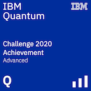

# Quantum Cloud Programming

This repo contains implementations of a few programs which can run on simulators as well as actual quantum hardware written using libraries provided by major quantum software stack providers.

Instructions for installing external dependecies and configuring each cloud provider are available in the respective folders.

## Index

| Organisation | Software / Product |         Program          |               Device Used                |                                Description                                 |
| :----------: | :----------------: | :----------------------: | :--------------------------------------: | :------------------------------------------------------------------------: |
|     IBM      |       Qiskit       |     Basics of Qiskit     |          Statevector Simulator           |                                                                            |
|              |                    |   Random bit generator   |               IBM-Q Armonk               | Single qubit circuit to understand the concept of circuits and gates in QC |
|              |                    |  Quantum teleportation   |          Statevector Simulator           |                                                                            |
|              |                    | Quantum key distribution |              QASM Simulator              |        Naieve implementation of BB84 quantum cryptography protocol         |
|              |                    |     Error correction     |        IBM-Q Athens / IBM-Q Rome         |      To demonstrate mitigation of read-out error in quantum circuits       |
|              |                    |   Circuit Optimization   |                    -                     |        Optimize a circuit presented in the form of a unitary matrix        |
|    Google    |        Cirq        |        Half adder        |              Cirq Simulator              |    The classic half adder circuited ported to run on quantum computers     |
|              |                    |                          |            Quantum Engine API            |                                                                            |
|   Rigetti    |       PyQuil       |     Shor's algorithm     |               15 qubit QVM               |      Implementation of Shor's algorithm for factorising prime numbers      |
|              |                    |                          |                   QPU                    |                                                                            |
|    DWave     |       Ocean        |      Maxcut problem      | DW_2000Q_6 (2000 qubit quantum annealer) |                   Optimization problem defined as a QUBO                   |
|              |                    |   0/1 knapsack problem   | DW_2000Q_6 (2000 qubit quantum annealer) |                   Optimization problem defined as a QUBO                   |
|              |                    | Task assignment problem  | DW_2000Q_6 (2000 qubit quantum annealer) |                   Optimization problem defined as a QUBO                   |
|    Zapata    |     Orquestra      |                          |                                          |                                                                            |
|  Microsoft   |      QDK + Q#      |                          |               Q# Simulator               |                                                                            |
|              |   Azure Quantum    |                          |                                          |                                                                            |
|    Xanadu    | Strawberry Fields  |                          |                                          |                                                                            |

## Certifications

- IBM Quantum Challenge 2020 ([Verify](https://www.youracclaim.com/badges/068a03e5-5111-4e88-aa12-6fb618ba5ca4/public_url))

  

- Summer school on hands-on quantum computing

    Organinised by Centro de Ciencias de Benasque Pedro Pascual in June 2020

## Remarks

- Programs implemented as a part of IBM Quantum Challenge (May 2020):

  - Basics of Qiskit
  - Quantum key distribution (using BB84 algorithm)
  - Error correction
  - Circuit Optimization

- Reference implementation for quantum teleportation: <https://github.com/quantumlib/Cirq/blob/master/examples/quantum_teleportation.py>

- BB84 algorithm: <https://en.wikipedia.org/wiki/BB84>

- Waiting for access to systems:

  - Google's Quantum Engine API
  - Rigetti's cloud QPU
  - Zapata's Orquestra
  - Microsoft's Azure Quantum

- The concepts of operations used in Xanadu's photonic quantum computers are completely different from superconducting and ion-trap based quantum computers.

- WIP

  - Implementation of any algorithm using Q# and QDK

## License

MIT License

Copyright (c) 2020 Shrey

Permission is hereby granted, free of charge, to any person obtaining a copy
of this software and associated documentation files (the "Software"), to deal
in the Software without restriction, including without limitation the rights
to use, copy, modify, merge, publish, distribute, sublicense, and/or sell
copies of the Software, and to permit persons to whom the Software is
furnished to do so, subject to the following conditions:

The above copyright notice and this permission notice shall be included in all
copies or substantial portions of the Software.

THE SOFTWARE IS PROVIDED "AS IS", WITHOUT WARRANTY OF ANY KIND, EXPRESS OR
IMPLIED, INCLUDING BUT NOT LIMITED TO THE WARRANTIES OF MERCHANTABILITY,
FITNESS FOR A PARTICULAR PURPOSE AND NONINFRINGEMENT. IN NO EVENT SHALL THE
AUTHORS OR COPYRIGHT HOLDERS BE LIABLE FOR ANY CLAIM, DAMAGES OR OTHER
LIABILITY, WHETHER IN AN ACTION OF CONTRACT, TORT OR OTHERWISE, ARISING FROM,
OUT OF OR IN CONNECTION WITH THE SOFTWARE OR THE USE OR OTHER DEALINGS IN THE
SOFTWARE.
